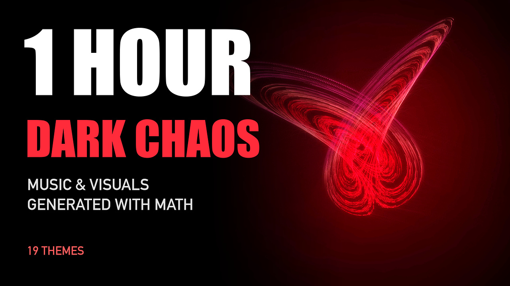
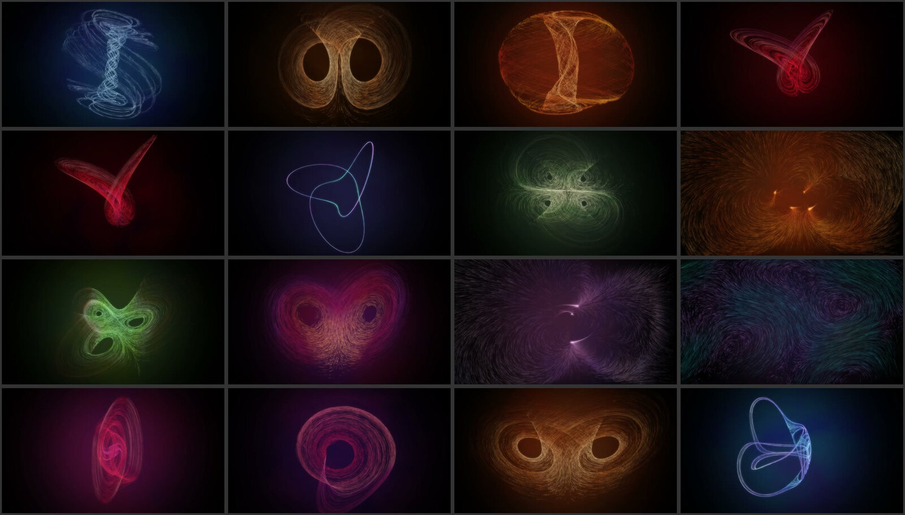
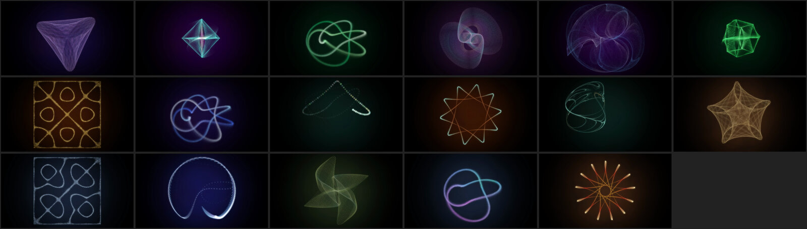

# Yalix Code Music

**Music and visuals synthesized with math and code.** One-hour mixes for focus and deep work where
every sound comes from oscillators, noise and filters, and every image is thousands of particles
following an equation: chaotic attractors, magnetic fields, n-body orbits, 4D polytopes.

No samples, no loops, no stock footage. This repository is the whole pipeline, from the first
sine wave to the 1440p video uploaded to YouTube.

[](https://www.youtube.com/watch?v=AG7-xFaraA0&t=633s)

▶ **Watch the first mix:** [1 Hour Dark Ambient for Focus · 19 Chaos Attractors Morphing](https://www.youtube.com/watch?v=AG7-xFaraA0&t=633s)
on the [Yalix Code Music](https://www.youtube.com/@yalixcodemusic) channel.



## How it works

### Music

Each theme is a short piece of parametric music rendered sample by sample with NumPy and SciPy.

- **Dark engine** (`music_v2.py`): odd meters, tribal toms, Fibonacci accents, FM, fuzz, square and sub
  basses, Karplus-Strong arpeggios, choirs, strings and bells built from additive synthesis.
- **Cyberpunk engine** (`music_cyberpunk.py`): supersaw pads that pump under the kick, a sixteenth-note
  arpeggio whose filter opens over the song, gated-reverb snares, four bass types (rolling, pulse,
  reese, FM), and synthesized textures: rain, typing, a typewriter, steam, a modem, server rooms.
- **Grunge engine** (`music_grunge.py`): doubled drop-D guitars, twin lead lines, quiet/loud dynamics,
  half-time and sludge grooves.
- Reverb is a convolution with decaying noise. Every track is loudness-normalized before mixing.

A spec per theme (tempo, scale, progression, groove, timbres, seed) gives each one its own atmosphere,
so nineteen themes in a row never sound like the same song twice.

### Visuals

A GLSL particle renderer (`gl_particles.py`, moderngl) draws 9,000 particles per frame with feedback
trails, a Gaussian bloom and an fbm-noise nebula, and pipes the frames straight into ffmpeg.

| Family | What the particles follow |
|---|---|
| Strange attractors | Lorenz, Rössler, Thomas, Aizawa, Halvorsen, Chen, Lü, Sprott, Rucklidge, Burke-Shaw, Dadras, Arneodo, four-wing |
| Fields | Magnetic dipoles, tripoles and quadrupoles; curl-noise flow; point vortices |
| Machines | Code rain, a packet network, a clockwork train |
| Cosmos (`gl_cosmos.py`) | Three- and four-body orbits (figure eight, binary, hierarchical), spiral and barred galaxies, harmonographs, Clifford and De Jong maps, spirographs |
| Forms (`gl_forms.py`) | Chladni plates, double pendulums, torus knots, a rotating tesseract and 16-cell, Maurer roses, phyllotaxis |



Every family follows one contract: per frame, normalized `xy` positions, a hue and a brightness per
particle. That is what lets one figure **morph into the next**: during a crossfade both scenes run,
and each particle travels from its place in the old figure to a place in the new one, paired by angle
around the centre so the flow stays orderly.

### Mixes

`mix.py` joins nineteen themes of 3:14 into one video of about an hour: each theme rendered on its own,
equal-power crossfades, AAC at 384 kbps and YouTube chapters written next to the video.

Videos are rendered at **2560×1440**. YouTube serves 1440p uploads with a better codec (VP9/AV1), so the
thin particle trails survive compression even for viewers watching at 1080p. Particles are drawn
brighter and thicker than they look best locally, for the same reason.

| Mix | Style |
|---|---|
| `dark` | Industrial, symphonic and progressive atmospheres |
| `cyberpunk` | Synthwave and darksynth in neon, with scanlines and glitches |
| `hackers` | Dark steampunk: phosphor screens, brass, clockwork, keyboards |
| `grunge` | Seattle-style songs with twin lead guitars |
| `deepspace` | Drumless pads, bells and choirs over orbits and galaxies |

## Usage

Requires Python 3.12, [uv](https://docs.astral.sh/uv/), ffmpeg and ImageMagick.

```bash
uv sync

uv run yalix-mix dark                       # output/mixes/dark-mix.mp4 + chapters
uv run yalix-mix dark --preview 150 270     # render only that window, to check a transition
uv run yalix-thumb dark                     # output/mixes/dark-mix.thumbnail.jpg

uv run yalix-series                         # single episodes of a series
uv run yalix-cyberpunk
uv run yalix-hacker
uv run yalix-grunge
uv run yalix-ambient --minutes 3 --name test   # the original Lissajous ambient video
```

On an Apple M1 Pro a one-hour mix renders in about 55 minutes at 1440p30.

## Layout

```
src/yalix_ambient/
  music_v2.py, music_cyberpunk.py, music_grunge.py   synthesis engines
  series.py, cyberpunk.py, hacker.py, grunge.py,     themes: a music spec and a visual per episode
  deepspace.py
  gl_particles.py                                    particle renderer, palettes, attractors
  gl_machines.py, gl_cosmos.py, gl_forms.py          non-attractor figure families
  mix.py                                             one-hour mixes, morphing, chapters
  thumbnail.py                                       YouTube thumbnails from a rendered frame
```

## License

The code is released under the [MIT License](LICENSE). The published videos and their music belong to
the Yalix Code Music channel.
